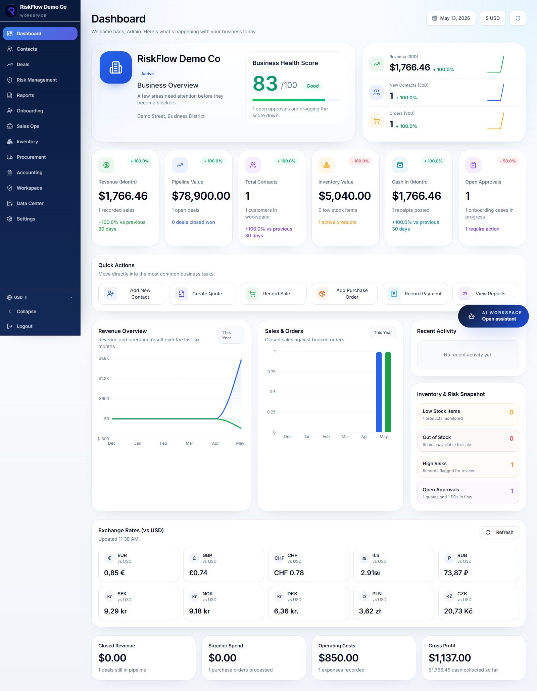
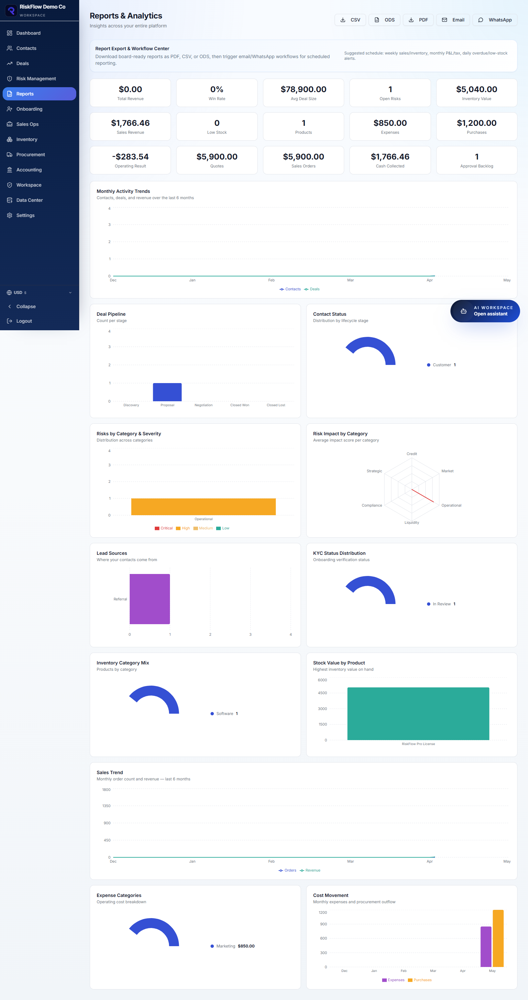
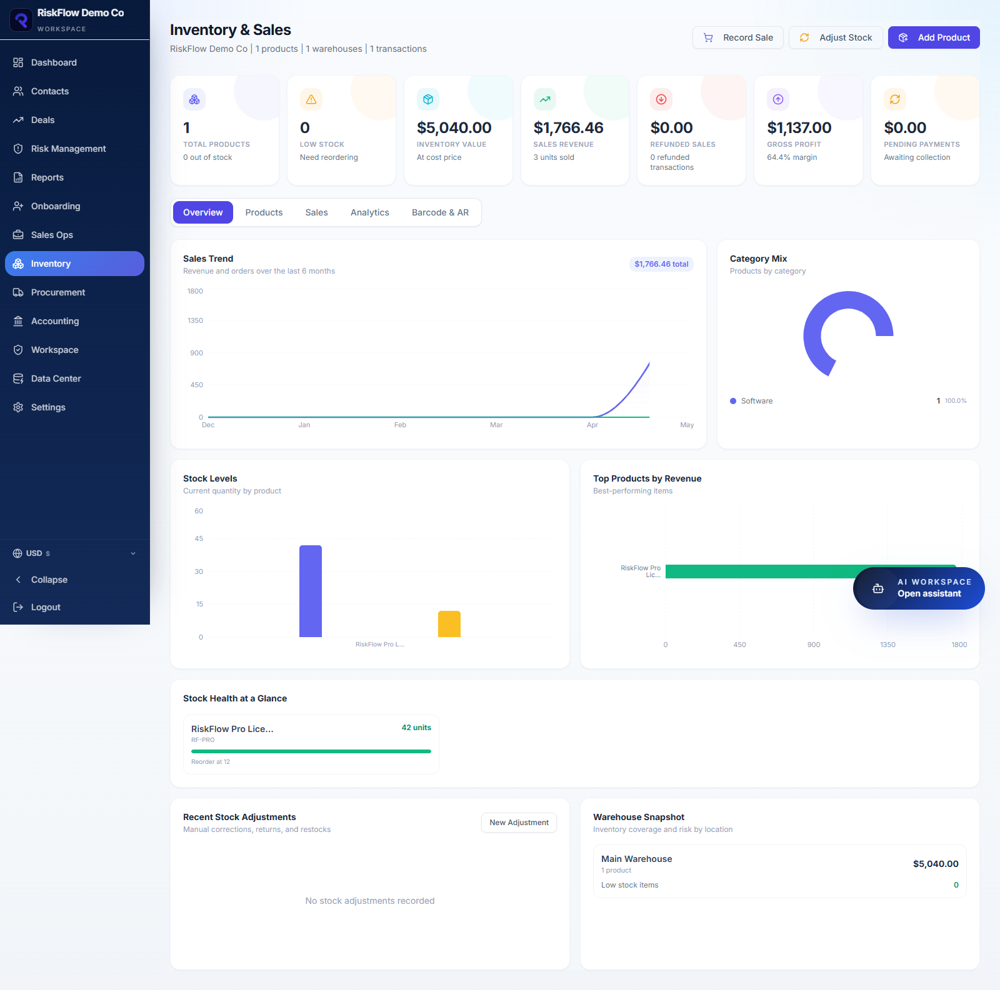
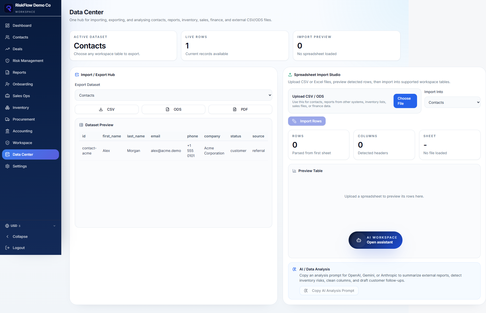
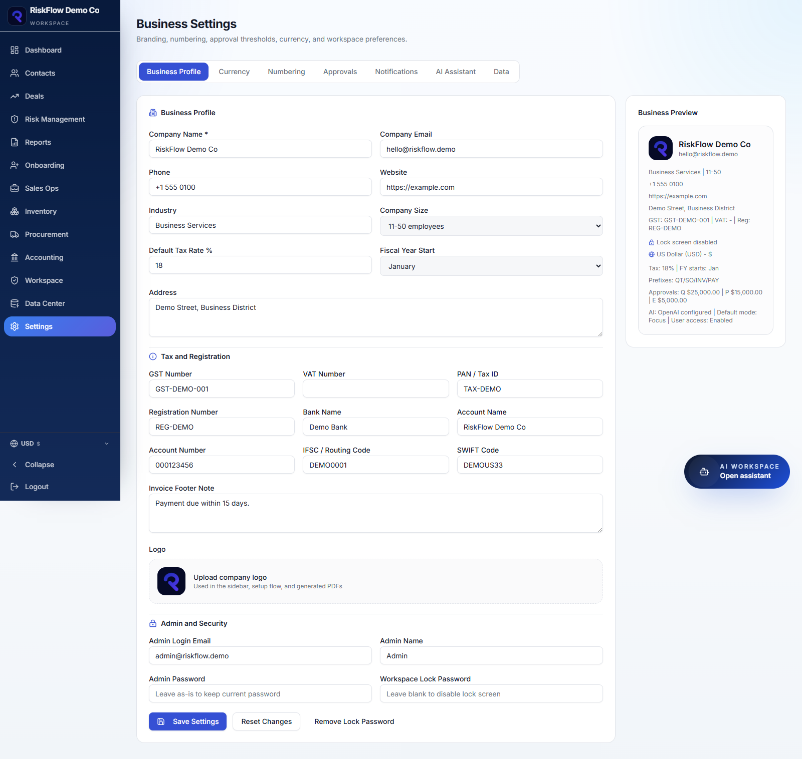
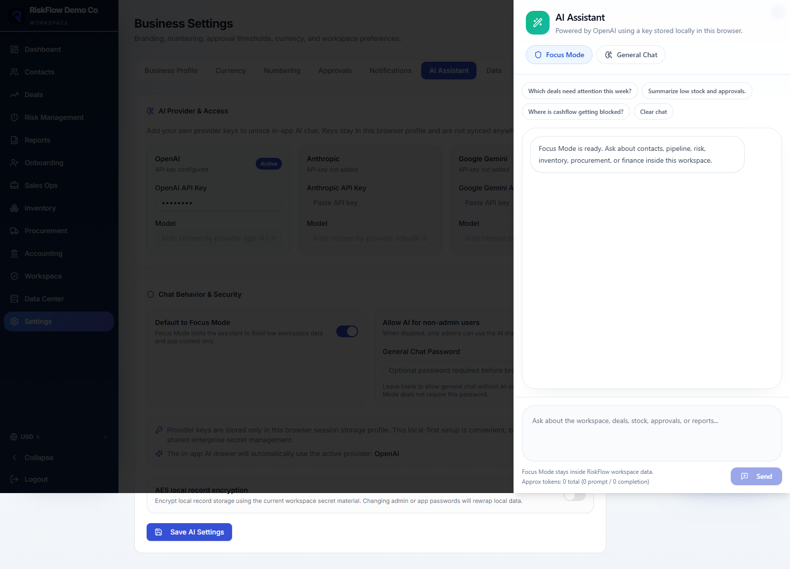

# RiskFlow CRM

RiskFlow CRM is a local-first business management workspace for CRM, sales, inventory, procurement, accounting, reports, branded invoices, ODS/CSV data import, and optional AI assistance.



## Features

- CRM contacts, deals, onboarding, and risk management.
- Inventory, sales, procurement, accounting, payments, approvals, and audit logs.
- Data Center for importing, exporting, and analysing CSV/ODS/Excel/Google Sheets files from one section.
- Report exports as PDF, CSV, and ODS.
- Branded invoice export with email and WhatsApp workflow links.
- AI assistant support for OpenAI, Gemini, and Anthropic keys configured inside the app.
- Barcode lookup and AR/3D reference fields for inventory.
- Local-first browser storage with a clean sign-up flow on first run.

## Screenshots

| Dashboard | Reports |
| --- | --- |
|  |  |

| Inventory | Data Center |
| --- | --- |
|  |  |

| Settings | AI Assistant |
| --- | --- |
|  |  |

More screenshots are available in `RiskflowCRM-App/github/screenshots`.

## Run

Double-click `Riskflow.bat`.

The launcher starts the local app server in the background and opens `http://127.0.0.1:5173/`.

## Development

```bash
cd RiskflowCRM-App
npm install
npm run dev
```

## Build

```bash
cd RiskflowCRM-App
npm install
npm run build
```

## Data And Privacy

RiskFlow CRM stores workspace data locally in the browser for `http://127.0.0.1:5173/`. There is no cloud sync by default. Users start from the sign-up screen on a clean install.

## Branding

The app uses `RiskflowCRM-App/public/riskflow-logo.png` as the primary logo. Replace that file with the final production logo before publishing screenshots or releases.

## License

Copyright (C) 2026 Kivitas

Licensed under the GNU Affero General Public License v3.0 only (AGPLv3). See `LICENSE`.
